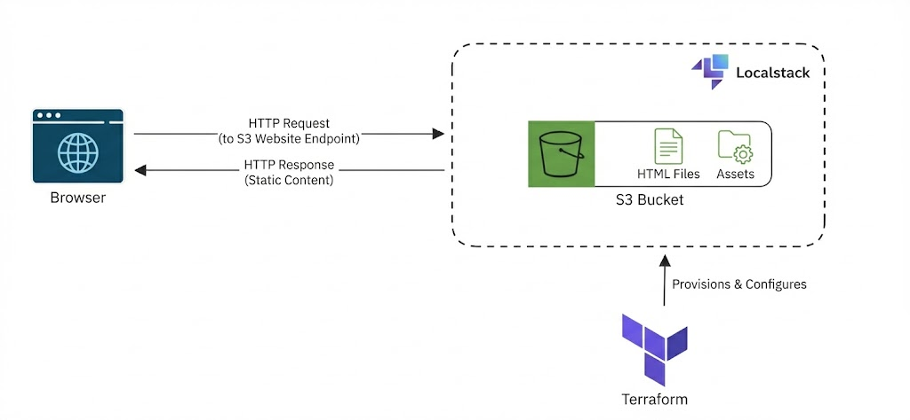

# ☁️ Projeto IaC: Website Estático com Terraform e LocalStack

Este projeto implementa uma infraestrutura como código (IaC) para hospedar um website estático utilizando um bucket S3. O ambiente AWS é simulado localmente através do **LocalStack**, permitindo desenvolvimento e testes ágeis sem custos de nuvem.

## 📐 Arquitetura

O fluxo da solução segue o modelo:

1.  **Terraform:** Provisiona e configura o Bucket S3 e as políticas de acesso no LocalStack.
2.  **S3 Bucket:** Armazena os arquivos estáticos (HTML, CSS, JS).
3.  **LocalStack:** Simula a API da AWS localmente.
4.  **Navegador:** Faz requisições HTTP para o endpoint local para renderizar o conteúdo.



## 🛠️ Pré-requisitos

* [Terraform](https://www.terraform.io/) instalado.
* [Docker](https://www.docker.com/) instalado.
* [LocalStack](https://localstack.cloud/) rodando (via Docker Compose ou CLI).
* [AWS CLI](https://aws.amazon.com/cli/) (opcional, para validações manuais).

## ⚙️ Configuração do Provider (Importante)

Para garantir a compatibilidade com o LocalStack e evitar erros de validação (como `AccountId` inválido ou erros de DNS), o `main.tf` utiliza configurações específicas no provider AWS:

```hcl
provider "aws" {
  region                      = "us-east-1"
  access_key                  = "test"
  secret_key                  = "test"

  # Ignora validações estritas da AWS real
  skip_credentials_validation = true
  skip_metadata_api_check     = true
  skip_requesting_account_id  = true # Essencial para evitar erros de Account ID no LocalStack

  # Força o estilo de caminho (localhost:4566/bucket) em vez de subdomínio
  s3_use_path_style           = true

  endpoints {
    s3  = "http://localhost:4566"
    sts = "http://localhost:4566" # Necessário para validação de identidade
  }
}
